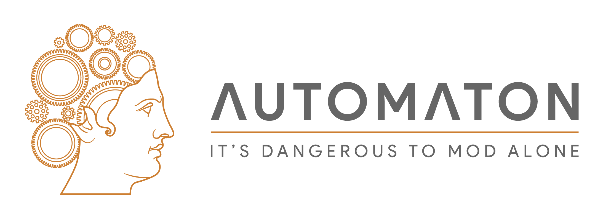

[Thanks to gatonegro for the logo](http://gatonegro.co/)

# What is Automaton?
> Automaton is the foundation and installer for the similarly  named _automaton framework_, which allows for modpack installation and creation in a way which respects mod author's rights. 

## How does it work?
> Automaton combines an easy-to-use modpack framework with extremely simple utilities that allow for even the most tech illiterate modder to have an identical setup to the developer's. In doing so, it does not (and _cannot_) infringe on any kind of content rights. No files are hosted by the framework, just the instructions to install them. 

## "Instructions to install them" -- what does this mean?
> The Automaton Framework works via local modpack files which act much like a user's manual -- just for the application instead. These files provide an instruction set to find, install and validate mods. When chained, entire modpacks can be installed in an extremely safe, quick, and most importantly _legal_ way. Information about modpack files will be found in the future when I get around to adding/updating the wiki.

## I'm a modpack author. Why should I invest my time into making a pack for Automaton?
> Automaton Framework modpacks offer numerous advantages to traditional approaches.
> Installations will be identical to your own, no matter the machine. Thus results in a massive reduction of bugs stemming from broken user installs, lessening the amount of time dedicated to support (and as I'm sure you know, would be a massive amount).

## How do I make a Modpack?
> Easy! Well, once I have a good tutorial up. At the current moment, modpacks can only be created by hand (which isn't as bad as it sounds). In the future however, expect some more advanced utilities to be released to make exporting to and creating modpacks much easier.

## Uh, I have some other question
> That's fine! I prolly didn't answer most of the common questions in the slightest (blame the 2 hours of sleep for that). You can add me on discord @metherul#1215, or reddit /u/metherul.
> Feature requests and bugs should be posted in this github repository.